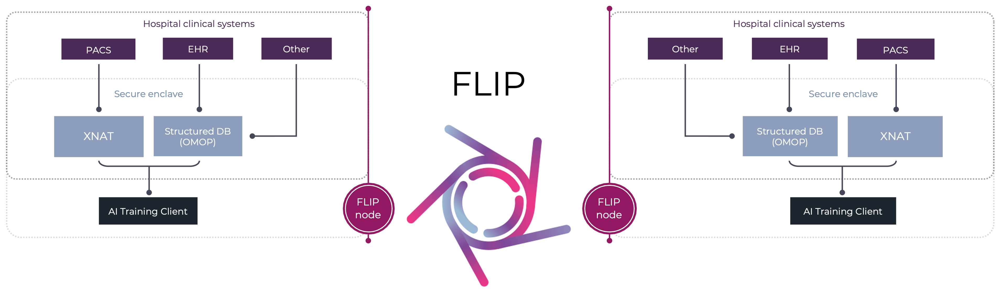

<!--
    Copyright (c) 2026 Guy's and St Thomas' NHS Foundation Trust & King's College London
    Licensed under the Apache License, Version 2.0 (the "License");
    you may not use this file except in compliance with the License.
    You may obtain a copy of the License at
        http://www.apache.org/licenses/LICENSE-2.0
    Unless required by applicable law or agreed to in writing, software
    distributed under the License is distributed on an "AS IS" BASIS,
    WITHOUT WARRANTIES OR CONDITIONS OF ANY KIND, either express or implied.
    See the License for the specific language governing permissions and
    limitations under the License.
-->

<p align="center"></p>

# Federated Learning and Interoperability Platform

[](https://opensource.org/licenses/Apache-2.0)
[](https://www.python.org/downloads/)
[](https://londonaicentreflip.readthedocs.io/en/latest/)
[](https://codecov.io/gh/londonaicentre/FLIP)

[](https://github.com/londonaicentre/FLIP/pkgs/container/flip-api)
[](https://github.com/londonaicentre/FLIP/pkgs/container/flip-ui)

[](https://github.com/londonaicentre/FLIP/pkgs/container/data-access-api)
[](https://github.com/londonaicentre/FLIP/pkgs/container/imaging-api)
[](https://github.com/londonaicentre/FLIP/pkgs/container/trust-api)

[](https://github.com/londonaicentre/FLIP/pkgs/container/orthanc)
[](https://github.com/londonaicentre/FLIP/pkgs/container/xnat-db)
[](https://github.com/londonaicentre/FLIP/pkgs/container/xnat-nginx)
[](https://github.com/londonaicentre/FLIP/pkgs/container/xnat-web)

FLIP is an open-source platform for federated training and evaluation of medical imaging AI models across healthcare institutions, while ensuring data privacy and security.

FLIP is developed by the [London AI Centre](https://www.aicentre.co.uk/) in collaboration with Guy's and St Thomas' NHS Foundation Trust and King's College London.

<p align="center"></p>

## Repositories

FLIP spans several repositories:

| Repository | Description |
| --- | --- |
| [FLIP](https://github.com/londonaicentre/FLIP) | This repo: Central Hub API, Trust APIs, UI, and Docker deployment |
| [flip-fl-base](https://github.com/londonaicentre/flip-fl-base) | NVIDIA FLARE federated learning base application library, workflows, and tutorials |
| [flip-fl-base-flower](https://github.com/londonaicentre/flip-fl-base-flower) | Flower federated learning base application library, workflows, and tutorials |

This repository consolidates all FLIP services in a mono-repo that can be deployed together via Docker Compose. The
federated learning images are pulled from [flip-fl-base](https://github.com/londonaicentre/flip-fl-base) and
[flip-fl-base-flower](https://github.com/londonaicentre/flip-fl-base-flower).

## Deployment

### Prerequisites

- [Docker](https://docs.docker.com/get-docker/) with [Swarm mode](https://docs.docker.com/engine/swarm/) initialized
- [Nvidia Container Toolkit](https://docs.nvidia.com/datacenter/cloud-native/container-toolkit/latest/install-guide.html)
- [Make](https://formulae.brew.sh/formula/make)
- [UV](https://docs.astral.sh/uv) - Python environment management tool
- postgresql-client (install with `apt install postgresql-client postgresql-client-common` on Debian/Ubuntu)

> For developer tooling and IDE setup, see [CONTRIBUTING.md](CONTRIBUTING.md).

### Using the Makefile

To start the services, you can use the Makefile provided in the root directory. The Makefile provides several convenient commands to manage the services defined in the [deploy/compose.development.yml](deploy/compose.development.yml) file.

For example:

| Command | Description |
| --------- | ------------- |
| `make up` | Run all services using Docker Swarm for XNAT (⚠️ This will not build the images, use `make build` first if needed)|
| `make up-no-trust` | Run all services except the trust services related services |
| `make up-trusts` | Run the trust services related services (uses Docker Swarm for XNAT) |
| `make central-hub` | Run the central API service, including the database and UI |
| `make build` | Build all Docker images |
| `make down` | Stop all services and remove the containers (including Swarm stacks) |
| `make restart` | Stop and start all services |
| `make restart-no-trust` | Stop and start all services except the trust services related services |
| `make clean` | Remove all stopped containers, networks, and images |
| `make ci` | Run the CI pipeline locally using `act` |
| `make up-local-trust-stag` | Run a local (on-premises) trust in staging mode (HTTPS via nginx-tls) |
| `make unit_test` | Run the tests for all services |

You can add new commands to the Makefile to create smaller deployments for testing and development.

### Docker Swarm Deployment

The XNAT services are deployed using Docker Swarm mode for better resource management and scalability. Docker Swarm is automatically used when running `make up` or `make up-trusts`.

**Key features of Swarm deployment:**

- Better resource allocation with CPU and memory limits
- Automatic service recovery with restart policies
- Overlay networking for secure service communication
- Support for multi-node deployment (if configured)

**Swarm-specific commands:**

- XNAT services are deployed as Docker stacks (`xnat1` and `xnat2`)
- The Swarm deployment uses the [trust/xnat/docker-compose-stack.yml](trust/xnat/docker-compose-stack.yml) file
- Networks are created as overlay networks with `--attachable` flag for flexibility

**Note:** Docker Swarm mode must be initialized on your system. If not already initialized, run:

```bash
docker swarm init
```

After that, you will need to restart the docker networks used by the services:

there is a command to create the networks, but you will need to remove them manually first if they are already running:

```bash
docker network rm deploy_trust-network-1
docker network rm deploy_trust-network-2
```

Then create the networks again:

```bash
make create-networks
```

To manually manage XNAT services (uses Docker Swarm):

```bash
cd trust/xnat
make up          # Start XNAT services
make down        # Stop XNAT services
make xnat-shell  # Get a shell in the XNAT container
```

### Trust API Key Setup

Before starting the platform, generate per-trust API keys and write them into `.env.development` using:

```bash
make generate-dev-keys
```

This generates a unique key for each trust found in `.env.development`, updates `PRIVATE_API_KEY_TRUST_<N>` and `TRUST_API_KEY_HASHES` in-place, and saves plaintext keys to `trust/trust-keys/`.

To generate a key for a single trust (e.g. when adding a new trust):

```bash
make -C flip-api generate-trust-key TRUST_NAME=Trust_1
```

### Basic Usage

To start the full platform locally:

```bash
make up
```

This will start all the services defined in the `deploy/compose.development.yml` file. The services will be started in detached
mode, so you can continue using your terminal. Use `docker compose ps` to see the status of the services and see which
ports they are running on.

To get a shell some of the services, you can run:

```bash
docker compose -f deploy/compose.development.yml exec < service-name > < command >
```

For example:

```bash
docker compose -f deploy/compose.development.yml exec flip-ui /bin/sh
```

This will give you a shell in the `flip-ui` container. You can run any command inside the container, including
installing new packages, running tests, and debugging the code.

To stop the services:

```bash
make down
```

If you want to run a single service you can run:

```bash
docker compose -f deploy/compose.development.yml run --rm < service name >
```

### Federated Learning Setup

The project supports [NVIDIA FLARE](https://developer.nvidia.com/flare) and [Flower Framework](https://flower.ai/) for federated learning. FLARE requires provisioned certificates and configuration files that are generated in the separate repository [flip-fl-base](https://github.com/londonaicentre/flip-fl-base) (see that repository for instructions on how to provision the workspace).

1. **Path Resolution**: While `.env.development` defines `FL_PROVISIONED_DIR` as a relative path (`../flip-fl-base/workspace`), the Makefile automatically converts this to an absolute path using:

   ```makefile
   override FL_PROVISIONED_DIR := $(shell realpath $(dir $(lastword $(MAKEFILE_LIST)))/../flip-fl-base/workspace)
   ```

   This ensures Docker volume mounts work correctly (Docker requires absolute paths) while maintaining portability across different machines.

2. **Why This Matters**: Docker Compose cannot resolve relative paths for volume mounts, so the absolute path conversion is essential for FL services to access their provisioned certificates and configuration files.

If you see errors like "fed_client.json does not exist" or "missing startup folder", verify that:

- The [flip-fl-base](https://github.com/londonaicentre/flip-fl-base) repository is cloned as a sibling directory
- The workspace has been properly provisioned with NVFLARE certificates
- The `FL_PROVISIONED_DIR` path is correctly resolved (check Makefile output)

## AWS Deployment

For production deployments on AWS, see the [AWS Deployment Guide](deploy/README.md). This covers provisioning
infrastructure with OpenTofu (Terraform), configuring AWS services, and deploying the platform at scale.

For hybrid on-premises trust deployments, see the [Local Trust Deployment Guide](deploy/providers/local/README.md).

## Project Structure

The repository is organised as follows:

- `deploy`: Contains the Docker deployment and infrastructure files
- `docs`: Contains the documentation files
- `flip-api`: Contains the central hub API service
- `flip-ui`: Contains the UI service
- `trust`: Contains the services that would be deployed in individual trust environments.
  - `data-access-api`: Contains the data access API service
  - `imaging-api`: Contains the imaging API service
  - `nginx`: Contains the nginx/TLS reverse proxy configuration
  - `observability`: Contains the observability stack (Grafana, Loki, Alloy)
  - `omop-db`: Contains a mocked OMOP database
  - `orthanc`: Contains a mocked PACS service (uses [Orthanc](https://www.orthanc-server.com/))
  - `trust-api`: Contains the trust API service
  - `nginx`: Contains the nginx TLS termination proxy for trust HTTPS endpoints
  - `xnat`: Contains a mocked [XNAT](https://www.xnat.org/) service

### HTTPS / TLS

Trust services are served over HTTPS via an nginx TLS termination proxy using self-signed CA certificates. The Central Hub verifies trust endpoints using a CA bundle containing all trust CAs. See [trust/README.md](trust/README.md) for certificate generation and setup, and [deploy/providers/local/README.md](deploy/providers/local/README.md) for hybrid on-premises deployment with HTTPS.

## Contributing

We welcome contributions from the community. See [CONTRIBUTING.md](CONTRIBUTING.md) for guidance on setting up a
development environment, adding new services, coding standards, testing practices, and the pull request process.

## Further Resources

- [Full Documentation](https://londonaicentreflip.readthedocs.io/en/latest/)
- [AWS Deployment Guide](deploy/README.md)
- [Debugging Guide](DEBUG.md)
- [Security & Secrets](scripts/README.md)
- [London AI Centre](https://www.aicentre.co.uk/)
