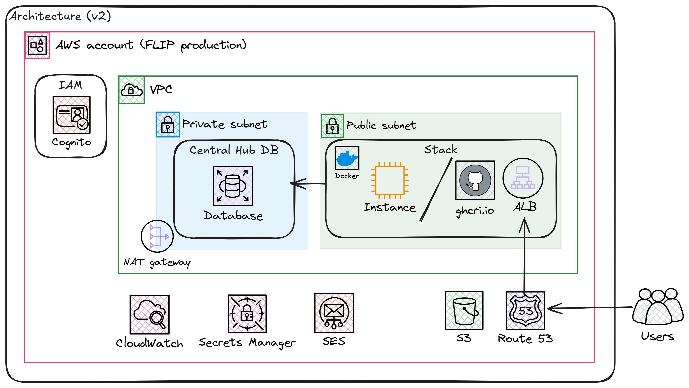

<!--
    Copyright (c) 2026 Guy's and St Thomas' NHS Foundation Trust & King's College London
    Licensed under the Apache License, Version 2.0 (the "License");
    you may not use this file except in compliance with the License.
    You may obtain a copy of the License at
        http://www.apache.org/licenses/LICENSE-2.0
    Unless required by applicable law or agreed to in writing, software
    distributed under the License is distributed on an "AS IS" BASIS,
    WITHOUT WARRANTIES OR CONDITIONS OF ANY KIND, either express or implied.
    See the License for the specific language governing permissions and
    limitations under the License.
-->

# FLIP AWS Terraform/OpenTofu and Ansible Infrastructure

Terraform/OpenTofu and Ansible Infrastructure as Code to deploy the FLIP application stack to AWS.

This provider manages the **Central Hub** (always in AWS) and, optionally, one or more **Trust** instances. Trust services can be deployed in two ways:

| Deployment Model | Trust Location | Managed By |
| --- | --- | --- |
| **Cloud** | AWS EC2 (same account as Central Hub) | This provider (`deploy/providers/AWS/`) |
| **Hybrid / On-Premises** | Any Ubuntu host (home lab, hospital server, etc.) | [`deploy/providers/local/`](../local/README.md) + selected targets in this Makefile |

In both models, trusts poll the Central Hub for tasks over HTTPS — all communication is **outbound from the trust** to the hub. The one exception is when `FL_BACKEND=flower`: the Central Hub FL API makes an inbound gRPC call to each Trust's supernode health port (`9098`) to check client connectivity.

## Prerequisites

1. **AWS CLI configured** with SSO access (see [deploy README](../../README.md))
2. **Terraform >= 1.13.1** or OpenTofu installed
3. **Python 3.12+**
4. **UV environment manager** installed via [uv installation guide](https://docs.astral.sh/uv/guides/install-python/)
5. **GitHub CLI** installed via [GitHub CLI installation guide](https://cli.github.com/)
6. **SSH key pair** created at `~/.ssh/host-aws` (see [deploy README](../../README.md))
7. **Environment files** configured: (see [deploy README](../../README.md))
   - `.env.stag` (staging) or `.env.production` (production) in project root
   - Service-specific `.env` files (see Environment Configuration section)

### Required AWS Permissions

Your AWS IAM role/user needs the following permissions for provisioning infrastructure:

- **SSM**: `ssm:GetParameter` for fetching AMI IDs
- **EC2**: Full access (VPC, instances, security groups, key pairs, Elastic IPs)
- **RDS**: `rds:CreateDBSubnetGroup`, `rds:CreateDBParameterGroup`, `rds:CreateDBInstance`
- **CloudWatch Logs**: `logs:*`
- **Secrets Manager**: Full access for storing database credentials and API secrets
- **IAM**: Create and manage roles for EC2 instances
- **Application Load Balancer**: Create and manage ALBs
- **SES**: Manage email templates (optional for email functionality)

Managed policies that cover these requirements:

- `AmazonEC2FullAccess`
- `AmazonRDSFullAccess`
- `CloudWatchLogsFullAccess`
- `SecretsManagerReadWrite`
- `IAMFullAccess`
- `ElasticLoadBalancingFullAccess`
- `AmazonSESFullAccess` (optional)

**Note**: The deployed EC2 instances use minimal IAM permissions (SSM, CloudWatch, and a scoped inline policy for `secretsmanager:GetSecretValue` on specific secrets) following the principle of least privilege.

## Deployment Workflow

### Full Stack Deployment

The complete deployment process is automated via the `full-deploy` target:

```bash
cd deploy/providers/AWS
make full-deploy PROD=stag  # For staging
# OR
make full-deploy PROD=true  # For production
```

This command executes the following steps in order:

1. **`github-login`**: Authenticate with GitHub CLI
2. **`aws-login`**: Authenticate with AWS SSO
3. **`init`**: Initialize Terraform with environment-specific S3 backend
4. **`import-persistent`**: Import existing persistent AWS resources to prevent replacement
5. **`plan`**: Generate and review the initial Terraform execution plan
6. **`apply`**: Apply infrastructure changes
7. **`update-env`**: Refresh the root environment file with Terraform outputs
8. **`ssh-config`**: Update `~/.ssh/config` with EC2 instance IPs
9. **`ansible-init`**: Configure EC2 instances with Docker, CloudWatch, and FL assets
10. **`deploy-centralhub`**: Deploy Central Hub services via Docker Compose
11. **`deploy-trust`**: Deploy Trust services via Docker Compose
12. **`status`**: Run comprehensive health checks

### Manual Step-by-Step Deployment

For debugging or selective deployment, run individual steps:

```bash
# 0. Choose the environment for this shell.
# If you omit PROD, the AWS provider Makefile defaults to staging.
export PROD=stag    # or: export PROD=true

# 1. Login to GitHub and AWS
make github-login
make aws-login

# 2. Initialize Terraform (creates/configures S3 backend)
make init

# 3. Import existing persistent resources (prevents replacement errors)
make import-persistent

# 4. Plan and apply infrastructure
make plan
make apply

# 5. Refresh environment values
make update-env

# 6. Configure SSH access
make ssh-config

# 7. Setup EC2 instances with Ansible
make ansible-init

# 8. Deploy services
make deploy-centralhub
make deploy-trust

# 9. Check status
make status
```

### Deployment to Different Environments

**Staging:**

```bash
make full-deploy PROD=stag
```

**Production:**

```bash
make full-deploy PROD=true
```

The `PROD` variable determines which environment files are loaded:

- `PROD=stag` → Uses the root `.env.stag`
- `PROD=true` → Uses the root `.env.production`

If `PROD` is omitted when running the AWS provider Makefile, it defaults to staging.

### Destroy Infrastructure

The destroy process preserves critical resources (Cognito, Secrets, S3) while safely removing infrastructure:

```bash
make destroy
```

**What gets destroyed:**

- Trust EC2 instance
- Central Hub EC2 instance
- Application Load Balancer
- RDS database (with skip-final-snapshot)
- VPC, subnets, security groups, NAT gateway
- IAM roles and policies
- Elastic IPs

**What gets preserved:**

- Cognito User Pool and users (authentication data)
- Secrets Manager secret (FLIP_API configuration)
- S3 bucket (application data)

### Status Checking

The deployment includes a comprehensive Python-based status checker:

```bash
make status
```

This validates:

- ✅ Terraform state and outputs
- ✅ VPC, subnets, and security group configurations
- ✅ EC2 instance health (Central Hub and Trust)
- ✅ RDS database connectivity
- ✅ Secrets Manager access
- ✅ S3 bucket accessibility
- ✅ Cognito User Pool configuration
- ✅ Docker services on EC2 instances
- ✅ HTTP endpoint availability
- ✅ SSH connectivity
- ✅ CloudWatch Logs configuration

## Hybrid Deployment: Adding an On-Premises Trust

To connect a local (on-premises) Trust host to the AWS Central Hub:

Recommended orchestration target (staging):

```bash
cd deploy/providers/AWS
make full-deploy-stag-hybrid LOCAL_TRUST_IP=<public-ip> [LOCAL_TRUST_SSH_KEY=~/.ssh/trust_key]
```

This wrapper target runs the full AWS deployment, provisions the local trust, and redeploys the Central Hub so the new secret values are loaded.
You still need to:

1. If `FL_BACKEND=flower` and the trust is behind NAT, forward `FLOWER_SUPERNODE_HEALTH_PORT/tcp` (default `9098`) from the router to the trust host LAN IP so the Central Hub FL API can reach the supernode health endpoint
2. Start the trust stack on the host: `cd trust && env PROD=stag make up-local-trust-stag`
3. Verify the trust can poll the hub (check trust-api logs for successful task polling)

Or run provisioning directly:

```bash
cd deploy/providers/AWS

# Remote host (via SSH)
make add-local-trust LOCAL_TRUST_IP=<public-ip> LOCAL_TRUST_SSH_KEY=~/.ssh/trust_key

# Local machine (no SSH)
set -x ANSIBLE_BECOME_PASS (read -s -P 'Sudo password: ')
make add-local-trust LOCAL_TRUST_IP=<public-ip>
```

After provisioning, complete the manual steps printed by the target:

1. Start the trust stack on the host: `cd trust && env PROD=stag make up-local-trust-stag`
2. Verify the trust can poll the hub (check trust-api logs for successful task polling)

Full details are in the [local provider README](../local/README.md).

## Troubleshooting

### Quick Diagnosis

First, run the automated status check script to identify issues:

```bash
make status
```

This will automatically diagnose:

- AWS resource health
- Network connectivity
- Application endpoint availability
- Docker container status
- System resource usage

Review the output for failed checks and follow the specific troubleshooting steps below.

## Architecture

### Services

The platform supports a cloud-only setup (Central Hub + Trust on AWS) or a hybrid setup (Central Hub on AWS + Trust on-premises). Trusts poll the Central Hub for tasks — all communication is outbound from the trust, except when `FL_BACKEND=flower` (the Hub FL API polls Trust supernode health on port `9098`).

1. **Central Hub EC2**: Hosts the main application services
   - flip-ui (Frontend)
   - flip-api (Backend API)
   - fl-api-net-1 (Federated Learning API for Network 1)
   - fl-server-net-1 (Federated Learning Server for Network 1)

2. **Trust EC2** (cloud model): Hosts trust-related services (automatically provisioned)
   - trust-api (polls hub for tasks)
   - imaging-api
   - data-access-api
   - fl-client-net-1 (FL Client for Network 1)
   - XNAT (medical imaging platform)
   - Orthanc (DICOM server)
   - OMOP database

3. **On-Premises Trust** (hybrid model, optional): Same trust services running on a local host
   - Provisioned via [`deploy/providers/local/`](../local/README.md)
   - Polls the Central Hub over the internet via HTTPS (outbound only)

| Application Component |
| ---------------------- |
| **Central Hub Services** |
| FLIP API ✅ |
| FLIP UI ✅ |
| FL API ✅ |
| FL Server ✅ |
| **Trust Services** |
| Trust API ✅ |
| Imaging API ✅ |
| Data Access API ✅ |
| XNAT (medical imaging) ✅ |
| Orthanc (DICOM server) ✅ |

```sh
┌─────────────────┐
│    Internet      │
└────────┬────────┘
         │
    ┌────▼────┐
    │   ALB    │ (HTTPS, ACM cert)
    └────┬────┘
         │
    ┌────▼──────────────────────┐
    │  Central Hub EC2          │
    │  - flip-ui                │
    │  - flip-api               │
    │  - fl-api                 │
    │  - fl-server              │
    └──────▲───────────▲────────┘
           │           │
     polls │           │ polls
    (HTTPS)│           │(HTTPS)
           │           │
    ┌──────┴─────┐  ┌──┴──────────────────────┐
    │ Trust EC2  │  │ On-Prem Trust (optional) │
    │ (AWS)      │  │ (home/hospital network)  │
    │            │  │                          │
    │ trust-api  │  │ trust-api                │
    │ imaging-api│  │ imaging-api              │
    │ data-acc.. │  │ data-access-api          │
    │ XNAT       │  │ fl-client                │
    │ Orthanc    │  │                          │
    │ fl-client  │  │                          │
    └────────────┘  └──────────────────────────┘
```



### Central Hub Infrastructure

- **VPC**: Custom VPC with public/private subnets
- **Central Hub EC2**: Single `t3.medium` instance running Docker containers (UI, API, FL services)
- **Trust EC2**: Separate `t3.xlarge` instance running Trust services via Docker Compose
  - Deployed using custom Terraform module (`modules/trust_ec2`)
  - Automatic Docker and Docker Compose installation via user_data
  - Automatic Docker network creation for inter-service communication
  - Optional Elastic IP for static addressing
- **ALB**: Application Load Balancer for traffic routing
- **RDS**: PostgreSQL 15 managed database (EOL: October 2027)
- **CloudWatch**: Logging and monitoring for both EC2 instances
- **Secrets Manager**: Secure storage for API secrets and database credentials
- **S3 Backend**: Remote state storage with environment-specific buckets

### Trust Infrastructure

Trust services can run on AWS EC2 or on-premises. Both models use the same Docker Compose stack. Trusts poll the Central Hub for tasks — all communication is outbound from the trust, except when `FL_BACKEND=flower` (the Hub FL API polls Trust supernode health on port `9098`).

**Cloud Trust (AWS EC2)** — deployed using the `trust_ec2` Terraform module:

- Automated Docker and Docker Compose installation
- Trust compose stack deployment via user_data script
- Automatic Docker network creation for inter-service communication
- Optional Elastic IP for static addressing

**On-Premises Trust** — provisioned via `make add-local-trust` and the Ansible playbook in [`deploy/providers/local/`](../local/README.md):

- Same Docker Compose stack, running on a local Ubuntu host
- UFW firewall allows FL ports from Central Hub IP only
- No inbound port forwarding needed for the trust API (trusts poll outbound). When `FL_BACKEND=flower`, port `9098` is the only inbound port (Hub → Trust)

### Port configuration

| Port | Service | Status | Purpose |
| ------ | --------- | --------- | --------- |
| **22** | SSH | 🟢 **OPEN** | Remote administration |
| **80** | HTTP | 🟢 **OPEN** | ALB traffic |
| **443** | HTTPS | 🟢 **OPEN** | ALB HTTPS entrypoint |
| **3000** | FLIP UI | 🟢 **OPEN** | Frontend application |
| **8080** | FLIP API | 🟢 **OPEN** | Backend API |
| **8000** | FL API | 🟢 **OPEN** | Federated learning API |
| **8002** | FL Server/Admin | 🟡 **CONDITIONAL** | Consolidated FL server/admin traffic (open to trust IPs only) |
| **9098** | Flower Supernode Health | 🟡 **CONDITIONAL** | Used only when `FL_BACKEND=flower`; Central Hub FL API polls Trust supernode gRPC health, restricted to Central Hub IP only |
| | | | Trust API: no inbound port needed (trusts poll the hub outbound) |

---

## Email Templates

All email templates are stored as standalone HTML files under `templates/`, organised by service. Both Terraform and the Python test utility load from the same files, ensuring a single source of truth.

### Template Structure

```sh
deploy/providers/AWS/
├── templates/
│   ├── cognito/
│   │   ├── invite.html                      # Temporary password invitation
│   │   ├── password_reset_code.html         # Password reset with verification code
│   │   └── password_reset_link.html         # Password reset with direct link
│   └── ses/
│       ├── flip-access-request.html         # Access request notification
│       ├── flip-access-request.txt          # Plain-text fallback
│       ├── flip-xnat-credentials.html       # XNAT credential notification
│       └── flip-xnat-credentials.txt        # Plain-text fallback
├── services.tf                              # Cognito config - loads cognito/ templates via file()
├── main.tf                                  # SES config - loads ses/ templates via file()
├── test_email_templates.py                  # Test utility for all templates
```

### How Templates Are Loaded

**Cognito templates** (services.tf):

```hcl
email_message = file("${path.module}/templates/cognito/invite.html")
```

**SES templates** (main.tf):

```hcl
html = file("${path.module}/templates/ses/flip-access-request.html")
text = file("${path.module}/templates/ses/flip-access-request.txt")
```

Changes to template files are automatically picked up on next `terraform apply` or test run.

### Template Placeholders

**Cognito templates** use single-brace placeholders substituted by AWS Cognito:

| Placeholder | Replaced By | Example |
| --- | --- | --- |
| `{username}` | Cognito username (email) | john.smith@example.com |
| `{####}` | 6-digit temporary password or verification code | 123456 |
| `{flip_alb_subdomain}` | ALB domain from Terraform var | flip-app.example.com |
| `{reset_link}` | Password reset link with token | https://flip.../reset?token=xyz |

**SES templates** use double-brace (Mustache) placeholders substituted at send time:

| Placeholder | Replaced By | Used In |
| --- | --- | --- |
| `{{name}}` | Requestor's name | access-request |
| `{{email}}` | Requestor's email | access-request |
| `{{purpose}}` | Access request purpose | access-request |
| `{{trust_name}}` | Trust name | xnat-credentials |
| `{{project_name}}` | XNAT project name | xnat-credentials |
| `{{project_id}}` | XNAT project ID | xnat-credentials |
| `{{username}}` | XNAT username | xnat-credentials |
| `{{password}}` | XNAT password | xnat-credentials |

### Quick Local Testing

```bash
cd deploy/providers/AWS

# Test all templates and generate HTML previews
python3 test_email_templates.py

# View in browser with local HTTP server
python3 test_email_templates.py --serve
# Open http://localhost:8000/flip_email_invite.html

# Test with custom data
python3 test_email_templates.py \
  --username "user@health.org" \
  --subdomain "flip-stag.example.com"
```

The validation script checks:

- HTML structure and syntax
- Placeholder substitution for both Cognito and SES templates
- FLIP branding colors (#61366e, #9452A8)
- Required text elements present
- Generates browser-viewable preview files

### Testing Emails End-to-End

After deploying, test that emails are delivered correctly by using the **Register User** workflow in FLIP. Registering a new user through the platform triggers the Cognito invitation email with the temporary password. This is the simplest way to verify the templates render correctly in a real email client.

### Email Client Compatibility

| Client | Support | Notes |
|--------|---------|-------|
| Gmail Web | Full | CSS gradients supported |
| Outlook Web | Full | CSS gradients with fallback |
| Apple Mail | Full | Dark mode compatible |
| Outlook Desktop | Mostly | Table layout reliable |
| Thunderbird | Full | Standard HTML support |
| Yahoo Mail | Good | Limited CSS support |

For professional cross-client testing: [Litmus](https://www.litmus.com/) or [Email on Acid](https://www.emailonacid.com/)

### SES Prerequisites

Before testing emails:

1. **Verify SES Email** in AWS Console (SES → Configuration → Identities)
2. **Sandbox Mode** (default): can only send to verified email addresses. Request production access in SES console.
3. **Check Send Quota**: `aws ses get-account-sending-enabled --region eu-west-2`

### Troubleshooting Email Issues

| Issue | Solution |
|-------|----------|
| Email gradients don't render | Most clients support gradients; solid color fallback in template |
| Button not clickable | Some clients disable links for security; check email client settings |
| Text wraps awkwardly | Tables use responsive max-width: 600px (standard) |
| Colors wrong in dark mode | Test in both light/dark modes; colors are contrast checked |
| Logo not loading | Verify the image URL is accessible (hosted on GitHub raw content) |
| Email not delivered | Check SES verification status and sandbox mode restrictions |

### Making Template Changes

1. **Edit template file** in `templates/cognito/` or `templates/ses/`
2. **Test locally**: `python3 test_email_templates.py` (verify all 5 pass)
3. **Review**: Check generated `email_previews/*.html` files in browser
4. **Deploy**: Changes are picked up on next `terraform apply`
