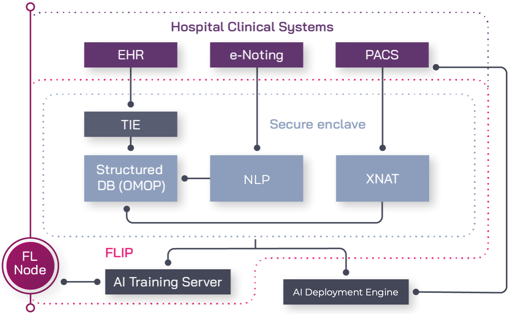

#########
Overview
#########

*************
How it works
*************

The Federated Learning Interoperability Platform (FLIP) is comprised of:

Secure Enclaves
===============

We are building dedicated secure data storage for processing and analysis within each of our partner NHS Trusts - a secure enclave or area within the firewall that keeps sensitive patient data inside the Trust.

Data from across the Trusts' patient records systems will be transferred into the secure enclave for curating and aggregation, unifying medical imaging scans from :term:`PACS` and other electronic health data.

   FLIP at a glance.

The secure enclave is comprised of multiple hardware and software components. We use high-performance NVIDIA DGX 1 processors to train our algorithms, which have the computing power to analyse hundreds of thousands of medical imaging scans in minutes.

XNAT, an open-source image informatics platform that ingests Digital Imaging and Communications in Medicine (DICOM, the industry-standard for medical images and related data) images from PACS, allows us to run our algorithms against automatically anonymised images safely.

Natural Language Processing (NLP) is used for information retrieval and extraction. The platform can process unstructured data from multiple sources and extract data from semantic information. 

A secure enclave (FLIP node) is created at partner sites and networked with the FLIP central hub.

Federated Learning
===================

AI algorithms need to train on diverse clinical datasets from multiple sources to ensure the resulting model is both reliable and generalizable.

Our federated learning approach brings algorithms to the data within each NHS Trust's secure enclave, without needing to share information outside the secure firewall or break local governance rules.

Algorithmic models are sent to multiple Trusts and trained on local data before being securely combined to achieve consensus. The model is then applied within each secure enclave, where it learns from the data, is updated again, and the process repeated until an improved consensus model is created.

To achieve convergence, the process of learning and combining is reiterated, until each locally applied model reaches the same conclusion, indicating that the model is generalizable and can be consistently applied.

Interoperability and data harmonisation
========================================

Electronic healthcare records are complex and heterogeneous, making it difficult to create interoperable algorithms that can be applied to data that is stored and categorised in different ways across multiple sites.

To harmonise this heterogeneous data, we use ontological and data interoperability standards to structure the data and make it actionable. When data is standardised and harmonised across multiple hospitals and clinical systems, it is possible for AI algorithms to query, learn and action data via an open standards-based data interface. This consistency makes interoperability possible, allowing researchers to extract valuable insights from multiple data sources.

*******************
How FLIP adds value
*******************
Our Federated Learning Interoperability Platform (FLIP) ensures a high level of fidelity in AI output models compared to traditional aggregative data strategies because the data it trains on does not need to be anonymised before use.

FLIP also allows us to adhere to each Trust's governance and data privacy regulations and ensures that our models are scalable in international contexts in full compliance with international laws and guidance.

FLIP will be deployed across seven NHS Trusts.