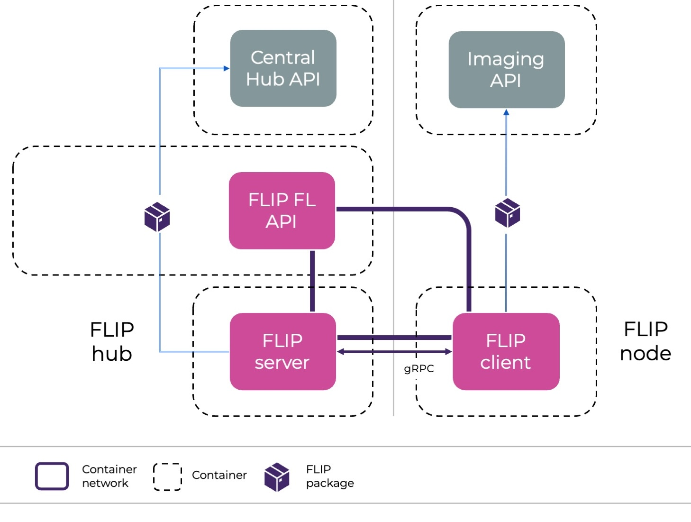
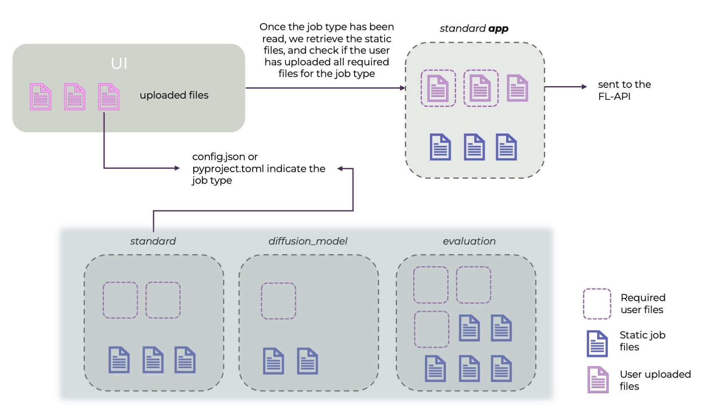

.. _flip-fl-nodes:

#########################
Federated Learning Nodes
#########################

FLIP supports two federated learning frameworks: NVFLARE and Flower AI. 
In both settings, the minimum components are:

- FL server: orchestrates the training process across sites and performs the aggregation of weights. It also uploads results at the end of the training.
- FL client: performs local training on the data at each site and sends the weights to the server.
- FL API: launches the training and acts as interface between the other FL components and the Central Hub API.

The FL API and Server are hosted at the Central Hub (in the Cloud), while client nodes are launched in the sites participating in a specific project (Cloud or on-premise).

   
   Depiction of the FL nodes and the services they communicate with.

Only the client will be running deep learning training, and therefore, requires access to GPU units.

Job types 
------------------------

Due to security restrictions, FLIP users are not allowed to control what happens on the server side.
Although most adjustable aspects of machine learning training happen on the client side 
(e.g. dataloading, training loop, model architecture), FLIP provides different job types
that the user can choose based on their needs.
Currently, these job types include federated averaging (job type `standard`),
evaluation task (job type `evaluation`), federated optimisation (job type `fed_opt`)
and diffusion model training (job type `diffusion_model`), which covers multi-stage federated training.
More job types will be added in the future, adjusting to the community's needs.

**How to choose a job type?**

A federated learning job is an ensemble of files (among which we can find `python`, `json` or `toml` files)
we call an app. Some of these files are required to run the app (for instance, the `pyproject.toml` file in a Flower app),
and some are optional. 

The job type is passed as key `job_type` in the `config.json` (for NVFLARE) or `pyproject.toml` (for Flower).

Once uploaded, the UI will indicate which files are required for the specific job. 

Then, the Central Hub API will take care of bundling together:
- The files the user has uploaded
- The static (non-modifiable) files that are required for the specific job type.

For more information about currently supported apps, visit `flip-fl-base <https://github.com/londonaicentre/flip-fl-base/tree/main/src>`_
and `flip-fl-base-flower <https://github.com/londonaicentre/flip-fl-base-flower/tree/main/src>`_ for NVFLARE and Flower respectively.

Examples of how the same job type (standard -> federated averaging) can run different user-uploaded applications are:

- `xray_classification <https://github.com/londonaicentre/flip-fl-base/tree/main/tutorials/image_classification/xray_classification>`_
- `3d_spleen_segmentation <https://github.com/londonaicentre/flip-fl-base/tree/main/tutorials/image_segmentation/3d_spleen_segmentation>`_

Both cases perform a supervised federated averaging training, but the data, architecture and training configuration are different.

   
   Workflow of how the user uploads files for a specific job type.

Data access and communication with external services
----------------------------------------------------

Though the user is allowed to upload the training script that will run on the client side, the access to data will have 
to be via the FLIP package (see `https://github.com/londonaicentre/flip-fl-base/tree/main/flip`).
This package, installed by default in client and server nodes, will make a series of functions available to the user. 

For data access:
- `flip.get_dataframe(project_id, query)`: retrieves the dataframe linked to the project ID and query that have been used on the project.
- `flip.get_by_accession_number(project_id, accession_id, resource_type)`: retrieves data of a certain type (e.g. NIFTI) associated with an accession ID. ``resource_type`` defaults to ``ResourceType.NIFTI`` and can be a single type or a list.

These calls - among others - communicate with the Imaging API and retrieve the data from the project's XNAT.

For communication with the Central Hub:
- `flip.update_status(model_id, new_model_status)`: these calls will update the Central Hub about status on the specific model that is running (example: when it started training, or if there's an error).
- `flip.send_metrics(client_name, model_id, label, value, round)`: sends a metric to the central hub so that it can plot the training results

The server will also use the package to update the status, as well as to upload the final results, which will be first saved in the server, to the final S3 buckets users can download from.

Disclaimer: some things are still under construction!
-----------------------------------------------------

There are currently some elements that are still under construction, and might not adjust exactly to 
the description above:

- for the Flower framework, users have to upload the `server_app.py` in addition to the `client_app.py` and additional auxiliary code, but in the future, this will not be the case. 
- the static files (non-modifiable files) from NVFLARE are being moved from S3 buckets to the flip package. Currently, anything that isn't the `config_fed_server.json` and `config_fed_client.json` files is hosted in S3 buckets, 
  whereas the rest of the files are in the flip package. You can check what a fully bundled app looks like by consulting
  the `src` folder in the `flip-fl-base` repository.
- we will be soon moving to a fully Pythonic version of NVFLARE apps, more up-to-date and easy to use.

