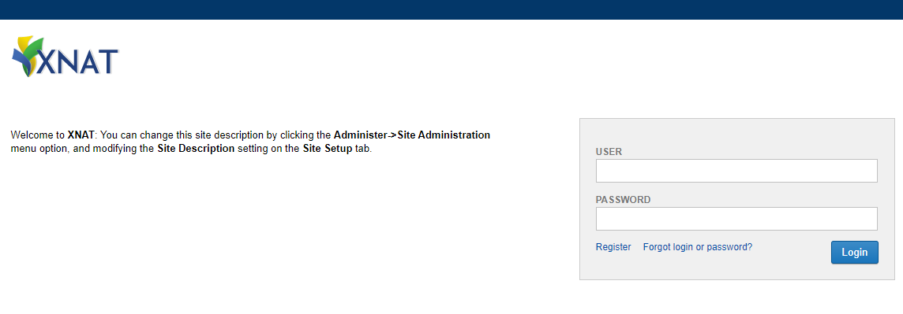

.. _flip-xnat:

####
XNAT
####

This page provides a quick-reference guide to both interactions with the XNAT UI which may be required in preparation for model training, and programmatic XNAT interactions which are made available during model training i.e. downloading imaging data.

`XNAT <https://www.xnat.org/>`_ is an open-source imaging informatics software platform dedicated to imaging-based research. XNAT's core functions manage importing, archiving, processing and securely distributing imaging and related study data. Detailed documentation on how to use XNAT is `provided on their wiki <https://wiki.xnat.org/documentation/how-to-use-xnat>`_.

Upon FLIP project approval, respective XNAT projects are generated at each trust and relevant imaging data is imported from trust PACS systems. Model developers are granted access to the XNAT project at each trust in order to perform any data preparation and enrichment activities which may be necessary for the running & training of AI models.

*******
XNAT UI
*******

.. _receiving-xnat-credentials:

Receiving XNAT Account Credentials
==================================

On approval of a FLIP project, any associated users will be granted access to the respective XNAT project at each trust. New XNAT user accounts will be generated as necessary. The email address associated with the FLIP user account will be sent details of their XNAT account credentials pertaining to each participating trust.

.. figure:: ../assets/xnat/credentials_email.png
    :width: 500
    :align: center

    Email sent with XNAT account credentials.

Access
======

XNAT instances are local to each participating trust. As such, model developers are required to access the local network at each Trust in order to access the XNAT web UI and perform any data enrichment activities.

Login
======

Navigate to the XNAT URL. The landing page should appear as follows:

    XNAT login page.

Enter the username and password per the :ref:`receiving-xnat-credentials` section and select 'Login'.

On login, the browser will be directed to the homepage, which lists existing projects and offers a project search capability:

.. figure:: ../assets/xnat/XNAT_home.png
    :width: 600
    :align: center

    XNAT homepage once logged in.

XNAT Project Structure and Navigation
=====================================

XNAT projects exist in the following structure:

.. list-table::
   :widths: 10 30
   :header-rows: 1

   * - Object
     - Object
   * - Project
     - Generated at FLIP Project approval
   * - Subject
     - Represents an individual. Anonymised ID is randomly generated on import
   * - Experiment
     - CT Session labelled with AccessionId
   * - Scan
     - A collection / series of imaging data
   * - Resource
     - Individual imaging data file e.g. DICOM, NIFTI

See `Understanding the XNAT Data Model <https://wiki.xnat.org/documentation/how-to-use-xnat/understanding-the-xnat-data-model>`_ for more information.

Project
^^^^^^^

XNAT projects generated by FLIP are identifiable by a Title which is derived from their FLIP counterpart i.e., **`[FLIP Project Name]`:`[FLIP Project ID]`-FL-Project**.

For example, **Ischemic Stroke Vessel Occlusion:2fd45bc9-861b-4467-9b78-813372a10682-FL-Project**.

To navigate to a project, select a project from the project list or search for a project via the home page.

.. figure:: ../assets/xnat/XNAT_project.png
    :width: 600
    :align: center

    An XNAT project.

The project page displays a list of contained subjects and permits various functions available from the right hand side 'Actions' menu.

Subject
^^^^^^^

Navigate to a subject by selecting it from a project's subject list.

.. figure:: ../assets/xnat/XNAT_subject.png
    :width: 600
    :align: center

    A specific subject.

The subject page displays a list of contained experiments (CT Sessions) and permits various functions available from the right hand side 'Actions' menu.

CT Session
^^^^^^^^^^

Navigate to a CT session by selecting it from a subject's list of experiments.

.. figure:: ../assets/xnat/XNAT_ct_session.png
    :width: 600
    :align: center

    A specific CT session.

A CT session is derived from an imported PACS DICOM Study. The CT session page contains a list of scans in which imaging study data is contained. This includes imported DICOM images and the respective NIFTI files which have also been made available.

Downloading and Uploading Imaging Data
=======================================

Imaging data will be automatically imported from trust PACS systems on XNAT project generation. Model developers may wish to download this data or upload new or amended imaging data to support model development.

Information on how to download and upload imaging data the XNAT UI can be found `here <https://wiki.xnat.org/documentation/how-to-use-xnat#HowToUseXNAT-UploadingImageDatatoXNAT>`_.

****************************
DICOM Anonymization
****************************

XNAT includes a built-in anonymization engine that processes incoming DICOM data to remove Protected Health Information (PHI) from DICOM headers. The anonymization script is applied site-wide to all data received via the SCP receiver.

Default Anonymization Script
============================

XNAT ships with a minimal default anonymization script that can be retrieved via the API:

.. code-block:: bash

    curl -X GET "http://<xnat-host>/xapi/anonymize/default" -H "accept: text/plain"

The default script performs only basic label mapping:

.. code-block:: text

    //
    // Default XNAT anonymization script
    // XNAT http://www.xnat.org
    // Copyright (c) 2005-2017, Washington University School of Medicine
    // and Howard Hughes Medical Institute
    // All Rights Reserved
    //
    // Released under the Simplified BSD.
    //
    version "6.1"
    project != "Unassigned" ? (0008,1030) := project
    (0010,0010) := subject
    (0010,0020) := session

FLIP Anonymization Script
=========================

FLIP replaces the default script with a comprehensive site-wide anonymization script (``anon_script.das``) that provides more thorough PHI removal, including:

- **Patient identifiers**: birth date, address, telephone numbers, other patient IDs
- **Institutional identifiers**: institution name, address, department
- **Physician/operator identifiers**: referring, performing, and requesting physicians
- **Other identifying tags**: accession number, medical record locator, ethnic group, occupation
- **UID pseudonymization**: study and series instance UIDs are hashed for repeatable pseudonymization
- **De-identification recording**: sets ``Patient Identity Removed`` and ``De-identification Method`` tags

The script is configured automatically during XNAT initialization via ``configure-xnat.sh``. It is applied to all incoming DICOM data when the SCP receiver has ``anonymizationEnabled`` set to ``true``.

Anonymize API Endpoints
=======================

The following XNAT anonymize-api endpoints are used by FLIP:

.. list-table::
    :widths: 10 30 30
    :header-rows: 1

    * - Method
      - Endpoint
      - Description
    * - GET
      - ``/xapi/anonymize/default``
      - Gets the default anonymization script
    * - PUT
      - ``/xapi/anonymize/site``
      - Sets the site-wide anonymization script
    * - PUT
      - ``/xapi/anonymize/site/enabled``
      - Enables or disables the site-wide anonymization script

*****************
FLIP XNAT methods
*****************

The following methods are available to be used in training, located in the `flip-utils package <https://flip-fl-base.readthedocs.io/en/latest/index.html>`_:

- ``get_dataframe(self, project_id: str, query: str) -> DataFrame``
    This retrieves data in the form of a Dataframe containing, at the minimum, accession IDs. The method takes in the project ID and the project query as parameters. These values are already passed in as parameters to the trainer to be used.

- ``get_by_accession_number(self, project_id: str, accession_id: str) -> Path``
    This downloads scans and places them in a directory made available for NVIDIA FLARE to utilise. The method takes in the project ID as a parameter as well as an accession ID, which can be  obtained from `get_dataframe`. It returns the path to where the scans are stored.

- ``add_resource(self, project_id: str, accession_id: str, scan_id: str, resource_id: str, files: List[str])``
    This allows uploading scans to XNAT under the project that the model to. Scans are to be placed in the `uploads` directory. The method does not have a return type. It supports the following required parameters:

    - project ID
    - accession ID
    - scan ID (ID/label of the directory at the scan level)
    - resource ID (ID/label of the directory at the resource level)
    - a list of files corresponding to the names of the files that reside within the `uploads` directory that you wish to upload, e.g. [`scan-1.dcm`, `scan-2.dcm`, ...].

    The list of files could also point to locations in subfolders relative to the uploads directory, e.g. [`subfolder/scans/scan-1.dcm`, `scan-2.dcm`], where `scan-1` has the path `uploads/subfolder/scans/scan-1.dcm` and `scan-2` has the path `uploads/scan-2.dcm`.
