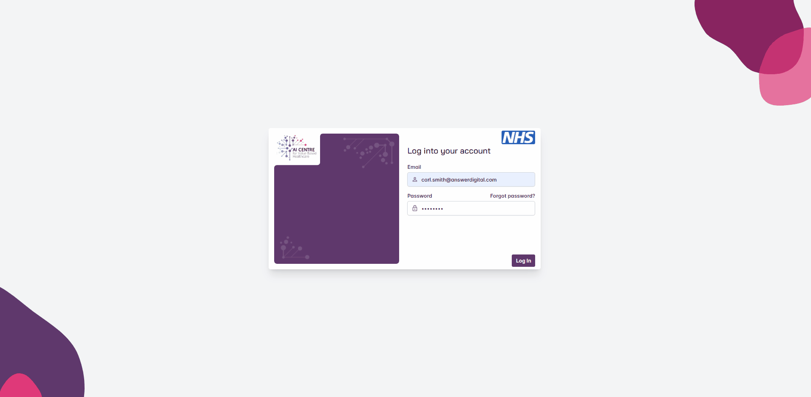
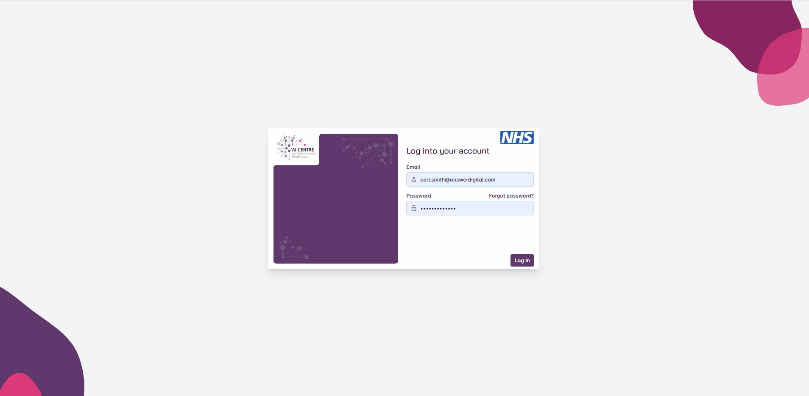
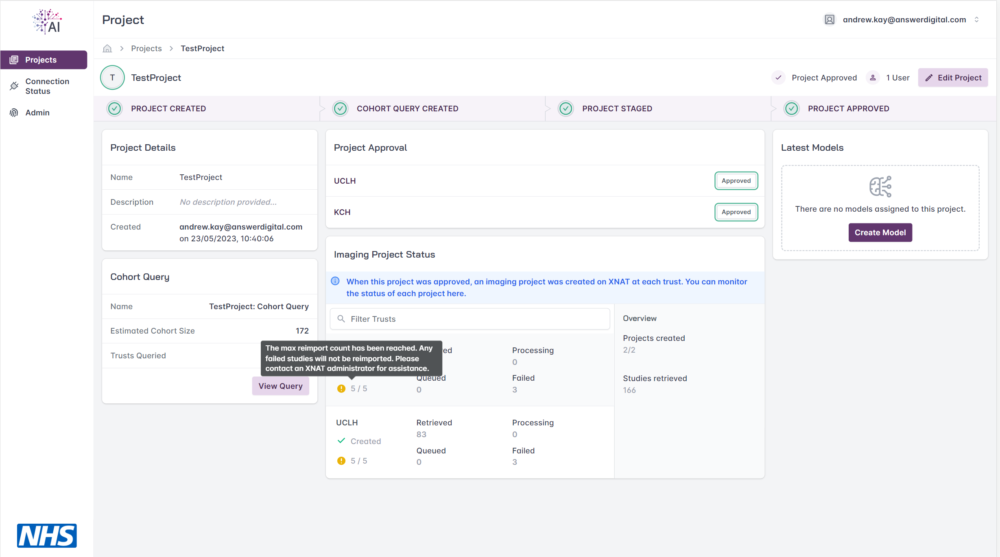

######################
Common user functions
######################

.. warning:: Must have a valid FLIP account. If you do not have one, please liaise with your local FLIP system administrator and/or information asset owner (IAO), and provide your email address and confirmation of which role(s) you require.

Although this page covers functions common to all FLIP users regardless of :ref:`rbac-roles` throughout the various stages involved in preparing an AI model for federated learning, actions related to project process flow are described from the perspective of users with a ``researcher`` role.

While users with ``admin`` roles may perform all the functions of those with ``researcher`` roles, the former are solely responsible for approving and un-staging a project. For information, please refer to the :ref:`admin-project-and-user-management` subsection or the broader :ref:`sys-admin` section.

FLIP uses the concept of a *project*, in which multiple AI models can be managed. Projects can have multiple users associated with them, allowing individuals to view and contribute to the project. The typical project flow involves the creation of a project, running a cohort query, staging the project for approval, uploading the model plus any associated files and initiating the training. Once training is complete, the results of training can be downloaded.

To facilitate federated learning and concurrent training of multiple models on the platform, :term:`NVIDIA FLARE` has been chosen as the SDK to enable collaborative workflow and so this page also covers concepts of NVIDIA FLARE *nets* and job scheduling.

.. _initial-login:

**************
Initial Login
**************

1. Enter your email address and one-time password
2. Click the 'Login' button
3. Reset password

.. note::

   The password must meet minimum complexity requirements, consisting of at least 8 characters which include upper and lowercase letters, at least one numeric character and at least one special character e.g., ``@``, ``#``, ``&``, ``!``, ``?``, etc.

   Logging into FLIP for the first time.

.. _forgot-password:

***************
Forgot Password
***************

1. Click the 'Forgot Password?' button on the login page
2. Enter the email address for your FLIP account
3. Click the 'Request Code' button
4. After you have received the confirmation code be sent by email, enter the confirmation code and a new password
5. Click the 'Change Password' button

   Resetting a forgotten password.

.. note::

   You may also speak to your local FLIP system administrator and ask them to perform the reset for you, in which case you will receive an email including the confirmation code required to change your password.

   In this case, you will select the 'I have a code' button rather than the 'Request Code' button in the above process.

********
Projects
********

.. warning:: Must be logged into FLIP and have the appropriate :term:`RBAC` :ref:`rbac-roles`.

Once logged in, you'll be presented with the Projects page, in which you can create new projects, view projects that you have created or projects that you have been invited to participate in.

Create Project
==============

1. Click the 'Create Project' button on the top right-hand corner of the page
2. Enter the project name and description
3. If necessary, enter the email addresses of other FLIP users and click the 'Add' button to enable them to view, edit, and/or contribute to the project
4. Click the 'Create Project' button

.. figure:: ../assets/flip/create-project.gif
   :width: 600
   :align: center

   Creating a new project.

Edit Project
============

1. Click the 'Edit Project' button
2. Update the project details, such as project name, description and added users

.. warning::

   Projects may be edited up until the point at which it is staged for approval. If a project needs to be amended after staging, you will need to liaise with your local FLIP administrator *un-stage* the project and re-enable editing.

Delete Project
==============

.. note::

   You must be either the project owner or a user with the ``admin`` role to perform this action.

   Projects can be deleted at any time, but:

   - Any running training sessions will be deleted and no longer accessible
   - Images associated with the project will be deleted from XNAT
   - The project will no longer be visible within XNAT

1. Select 'Edit Project'
2. Under 'Advanced Options', click the 'Delete Project' button
3. Enter the project name
4. Click the 'Continue' button

.. figure:: ../assets/flip/delete-project.gif
   :width: 600
   :align: center

   Deleting a new project.

Project List
============

All projects which you are able to access are visible on the project list, including those which you have created or have been granted access to. Users with the ``admin`` role will be able to view all projects.

Users can apply a filters to view only projects based on, for example, the current user, keywords found in the project and/or project description.

.. figure:: ../assets/flip/filter-project.gif
   :width: 600
   :align: center

   Filtering list of projects.

Cohort Query
============

Cohort data is stored within a `PostgreSQL <https://www.postgresql.org/>`_ database conforming to the `standard OMOP data model <http://omop-erd.surge.sh/omop_cdm/index.html>`_, with the `R-CDM radiology tables <https://www.ncbi.nlm.nih.gov/pmc/articles/PMC8790584/>`_ included. The radiology_occurrence table has been modified to include an ``accession_id`` field which contains the reference to the associated DICOM series. As this is the field that XNAT will read from when retrieving the associated DICOM series from PACS, the 'accession_id' needs to be included in all queries if relevant images are to be made available.

.. _create-cohort-query:

Create Cohort Query
-------------------

.. note::
    A number of keywords are restricted and the cohort query will not be run in the instance that any of these keywords are entered, such as:

        - ``alter user``
        - ``alter table``
        - ``alter database``
        - ``drop table``
        - ``drop user``
        - ``drop role``
        - ``drop database``
        - ``create table``
        - ``substring``

1. Click the 'Create Cohort Query' button in the bottom left corner of the project page
2. Enter a query in SQL format, for example:

   .. code-block:: sql

       SELECT accession_id, concept_name, year_of_birth FROM omop.person p
       JOIN omop.radiology_occurrence r ON r.Person_Id = p.Person_Id
       JOIN omop.concept c ON p.gender_concept_id = c.concept_id
       WHERE year_of_birth < 1980

3. Click on the 'Run & Save Query' button
4. View results returned in graphical format

.. figure:: ../assets/flip/cohort-query.gif
   :width: 600
   :align: center

   Creating a cohort query.

Edit Cohort Query
=================

.. warning::

   A project's cohort query may be edited up until the point at which it is staged for approval. If a project's cohort query needs to be amended after staging, you will need to liaise with your local FLIP administrator *un-stage* the project and re-enable editing.

In the event users want to amend the project cohort query or need to due to query timeouts, they can do so and re-run the query.

1. On the Project page, click the 'View Query' button
2. The cohort query can be amended and re-run following the steps outlined in the :ref:`create-cohort-query` section

Project Staging
===============

.. note::

   You will be able to 'stage' your project for approval once the project has a cohort query saved.

Staging allows you to select which Trusts will be requested for approval and included in the model training cycle, i.e. use the toggle switch next to each Trust to include/exclude them.

.. warning::

   Once staged, the project details and cohort query are locked from further editing. If a project's details and/or cohort query needs to be amended after staging, you will need to liaise with your local FLIP administrator *un-stage* the project and re-enable editing.

.. figure:: ../assets/flip/stage-project.gif
   :width: 600
   :align: center

   Staging a project.

Project Approval
================

Once staged for approval, it is the responsibility of the FLIP Central Hub Admin to complete the approval process **offline** and update the FLIP platform with the outcome.

.. note::

   Following approval, any Trusts which have declined to participate in the project will be unavailable and excluded from model training.

Imaging Project Status
======================

Following project approval, a corresponding XNAT project will be generated at each participating Trust and relevant imaging data will be imported from their respective PACS systems. For more information on this integration, please see the :ref:`flip-xnat` page.

To view the progress of the imaging data import at each participating Trust, users can refer to the Imaging Project Status section on the project page.

.. figure:: ../assets/flip/imaging-status.png
   :width: 600
   :align: center

   Imaging status overview

.. note::

   Importing large sets of studies from PACS systems can take a very long time and individual imports may fail if the system is under too much strain. Overtime, FLIP will automatically reimport failed studies as indicated by the reimport count.
   Once the reimport cap is reached, failed studies will no longe be reimported. If there are still failures present, please contact an XNAT administrator. Manual intervention may be needed.

   Reimport cap has been reached

Trust sites can be filtered using the search bar at the top of the imaging project status section.

.. figure:: ../assets/flip/imaging-status-filter.gif
   :width: 600
   :align: center

   Filter imaging status trust locations

*******
Models
*******

.. warning:: Project must be approved before proceeding with creating models and initiating training.

Create Model
=============

1. Navigate to the project page
2. Click the 'Create Model' button
3. Enter a name and brief description
4. Click the 'Create Model' button

.. figure:: ../assets/flip/create-model.gif
   :width: 600
   :align: center

   Creating a model.

Edit Model
==========

.. note::

   Users can edit the model up until the point at which the model's training has been initiated.

1. Navigate to the project page
2. Click the 'Edit Model' button
3. Update the model details, such as model name and description

.. figure:: ../assets/flip/edit-model.gif
   :width: 600
   :align: center

   Editing a model.

Delete Model
============

.. note::

   You must be either the project owner or a user with the ``admin`` role to perform this action.

   Models can be deleted at any time, but if training is in progress at the time of deletion, the model training will be stopped and the model will no longer be accessible.

1. Navigate to the project page
2. Click the 'Edit Model' button
3. Under 'Advanced Options', click the 'Delete Model' button
4. Enter the model name
5. Click the 'Continue' button

.. figure:: ../assets/flip/delete-model.gif
   :width: 600
   :align: center

   Deleting a model.

Model Files
===========

.. note::

   A model must be created before proceeding to upload model files and prepare the model for training.

As a minimum, the following files are required:

- ``validator.py``
- ``trainer.py``

Additional files may be uploaded, especially if these are referenced by the validator or trainer. A config file may also be uploaded (see :ref:`training-configuration` section for more information), in which optional variables can be defined.

For more information on model training and model files, please see the `FLIP Sample Application <https://github.com/AI4VBH/flip-sample-application>`_.

.. warning::

   Please ensure that any model files uploaded to FLIP have been tested locally using the FLIP Sample Application, and have been validated to ensure they are free of syntax errors.

   Linting tools such as `Pylint <https://pypi.org/project/pylint/>`_ and `JSON Lint <https://www.npmjs.com/package/jsonlint>`_ can provide a simple way to validate any Python or JSON are free of errors before uploading.

Upload Files
------------

1. Navigate to the project page
2. Navigate to the Model Files section on the left-hand side of the model page
3. Either browse to the files on your local file system or drag and drop them into the box on screen
4. You will receive confirmation once your files have successfully uploaded

.. note::

   As files are uploaded, they are scanned for vulnerabilities and viruses.

If model files need to be managed further after uploading, the uploader function allows files to be downloaded, removed and re-uploaded.

.. figure:: ../assets/flip/upload-file.gif
   :width: 600
   :align: center

   Uploading files.

.. _training-configuration:

Training Configuration
----------------------

Prior to commencing training you may also upload an optional ``config.json`` file (see example below). The config file defines variables which are used during FLIP training (e.g. ``GLOBAL_ROUNDS``, ``LOCAL_ROUNDS``, ``AGGREGATION_WEIGHTS``, ``AGGREGATOR``).

.. code-block:: json

    {
      "GLOBAL_ROUNDS": 5,
      "LOCAL_ROUNDS": 2,
      "IGNORE_RESULT_ERROR": false,
      "AGGREGATOR": "InTimeAccumulateWeightedAggregator",
      "AGGREGATION_WEIGHTS": {
         "KCH": 1.0,
         "UCLH": 0.5
      }
    }

.. note::

   All config properties have default values. If a ``config.json`` file is not uploaded, or some properties are missing from the file, default values will be utilised at runtime.
   See default values specified below.

**GLOBAL_ROUNDS**
   Number of global training iterations. How many times the server should execute the ``trainer.py``.
   Must be greater than 0. Less than 100.

   *Default=1*

**LOCAL_ROUNDS**
   Number of local training iterations at client sites.
   Must be greater than 0. Less than 100.

   *Default=1*

**IGNORE_RESULT_ERROR**
   Whether training should proceed if a client returns an error.

   *Default=false*

**AGGREGATOR**
   The nvflare aggregation component used to aggregate training results from each client.

   .. warning::
      Allowed values are "InTimeAccumulateWeightedAggregator" or "AccumulateWeightedAggregator". As of v4, FLIP only supports aggregator components built into nvflare. Specifying any other value will cause
      a config validation error and prevent training from initiating.

   *Default="InTimeAccumulateWeightedAggregator"*

**AGGREGATION_WEIGHTS**
   Weight dictionary passed into the aggregator component to define its aggregation behaviour.

   .. warning::
      Client sites *must* be referenced via their common abbreviation e.g KCH=Kings College Hospital, UCLH=University College London Hospital.
      Weights must be provided as a valid json object.

   *Default=1.0 applied to each client site*

.. code-block:: json

    {
        "KCH": 1.0,
        "UCLH": 1.0
    }

View Files
----------

1. Navigate to the project page
2. Navigate to the Model Files section on the left-hand side of the model page
3. Click the download icon to view the contents of a file that has been uploaded

.. figure:: ../assets/flip/manage-files.gif
   :width: 600
   :align: center

   Managing uploaded files.

Delete Files
------------

1. Navigate to the project page
2. Navigate to the Model Files section on the left-hand side of the model page
3. Click the bin icon to delete a file that has been uploaded

Training
========

FLIP allows for multiple models to be deployed to and trained at multiple Trust sites concurrently, and uses :term:`NVIDIA FLARE` to train, test and aggregate at each of the relevant nodes and report back to the user interface once the training is complete.

FLIP uses the concept of *nets* that are deployed on the Central Hub and remote hardware at each Trust. Each *net* consists of a controller and worker (to manage the model training cycle) and FLIP uses a task scheduler to manage the resources available on the hardware at Trust sites. The scheduler maintains a queue of waiting *tasks*, when a *net* becomes free a *task* is assigned to it.

This scheduling capability means model developers can submit their model for training via the UI and need not be concerned with matters such as GPU capacity or existing jobs that are running/queued. When initiating training the platform will check for available nets and assign the model training to an available net.

Initiate Training
-----------------

When model files have been uploaded, you will then need to confirm that the dataset has been enriched and specify the number of local iterations.

.. note::

   You must confirm the data enrichment step is complete (even if no enrichment of the dataset was required and/or actually performed) before training can commence.

1. Navigate to project page
2. On the right-hand side, toggle the button to confirm the dataset has been enriched
3. Click the 'Initiate Training' button to start the training cycle
4. Once the training cycle has been initiated, the progress bar at the top of the page will update as the various stages of the training cycle complete i.e., a green tick will appear

On the right-hand side of the page a window will also pop up to provided detailed status updates i.e., with date and time stamps, against each activity. The status messages show the scheduling activities, including queuing, *net* assignment, training in progress and training complete.

.. figure:: ../assets/flip/initiate-training.gif
   :width: 600
   :align: center

   Initiating model training.

Stop Training
-------------

.. note::

   If the training has already completed the 'Stop Training' option will be greyed out (see :ref:`view-results`).

1. Click the 'Actions' drop-down menu
2. Click the 'Stop Training' button
3. When the model training has been stopped, the progress bar will show at which stage the process was stopped

.. figure:: ../assets/flip/stop-training.gif
   :width: 600
   :align: center

   Stopping model training.

.. _view-results:

View Results
------------

.. note::

   Model training must be completed before users are able to download the results.

1. Click the 'Actions' drop-down menu
2. Click the 'Download Results' button
3. Open the .zip file downloaded to your local machine to view the results

.. figure:: ../assets/flip/download-results.gif
   :width: 600
   :align: center

   Downloading model training results.

Metrics
-------

During the training cycle, any metrics specified by the model developer e.g., loss function, average score, etc., are displayed during and following the training cycle.

Hovering over the graphs at various points will display the values.

.. figure:: ../assets/flip/metrics.gif
   :width: 600
   :align: center

   Viewing model training metrics.